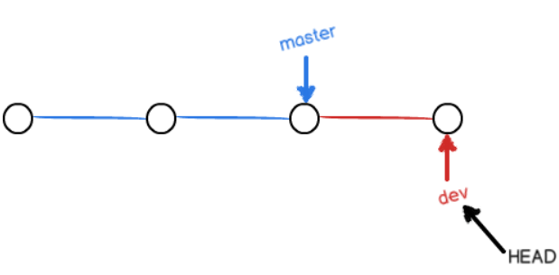

### 创建版本库
1. 在某个文件夹内打开 git bash
2. `git init`
3. `git add *filename.filetype*`
   (可以一次 add 多个)
4. `git commit -m *"xxx (输入你想写的注释)"*`

---

# 时光机穿梭

* 要随时掌握工作区的状态，
  使用`git status`命令。

* 如果`git status`告诉你有文件被修改过，
  用`git diff`可以查看修改内容。

---

## 版本回退

* HEAD指向的版本就是当前版本，因此，Git允许我们在版本的历史之间穿梭，使用命令`git reset --hard commit_id`。

* 穿梭前，用`git log`可以查看提交历史，以便确定要回退到哪个版本。

* 要重返未来，用`git reflog`查看命令历史，以便确定要回到未来的哪个版本。

---

## 工作区与暂缓区

#### 工作区

* 就是 git 库 所在的文件夹

#### 版本库

* 工作区文件夹内的 .git 文件夹
* `git add` 就是将文件修改添加到暂存区
* `git commit` 把暂存区的所有文件提交到当前分支
  
---

## 管理修改

* 每次修改，如果不用`git add`到暂存区，那就不会加入到`commit`中。
  
---

## 撤销修改

* 修改完文件, 还没有 `add` 时, 可以用 `git restore <file>`
* `add` 之后, 可以使用 `git restore --staged <file>`
* ***善用 `git status`***

---

## 删除文件

* `git rm` 用于删除 git 库中的文件

---
---

# 远程仓库

在 `cmd` 中使用 

`$ ssh-keygen -t rsa -C "youremail@example.com"`

创建 ssh , pub 为公钥

---

## 添加远程库

* 要关联一个远程库，使用命令`git remote add origin git@server-name:path/repo-name.git`；
  
* 改为使用 `git remote add origin https`

* 关联一个远程库时必须给远程库指定一个名字，origin是默认习惯命名；

* 关联后，使用命令`git push -u origin master`**第一次**推送master分支的所有内容；

* 此后，每次本地提交后，只要有必要，就可以使用命令`git push origin master`推送最新修改；

* **==SSL certificate problem: unable to get local issuer certificate==
    解决方法 : `$ git config --global http.sslverify false`**

---

## 从远程库克隆

* 要克隆一个仓库，首先必须知道仓库的地址，然后使用`git clone`命令克隆。

* Git支持多种协议，包括https，但ssh协议速度最快。

---
---

# 分支管理

* 分支在实际中有什么用呢？假设你准备开发一个新功能，但是需要两周才能完成，第一周你写了50%的代码，如果立刻提交，由于代码还没写完，不完整的代码库会导致别人不能干活了。如果等代码全部写完再一次提交，又存在丢失每天进度的巨大风险。

* 现在有了分支，就不用怕了。你创建了一个属于你自己的分支，别人看不到，还继续在原来的分支上正常工作，而你在自己的分支上干活，想提交就提交，直到开发完毕后，再一次性合并到原来的分支上，这样，既安全，又不影响别人工作。

---

##  创建与合并分支
>
>* `HEAD`严格来说不是指向提交，而是指向`master`，`master`才是指向提交的，所以，`HEAD`指向的就是当前分支。
>
>

>* 当我们创建新的分支，例如`dev`时，Git新建了一个指针叫`dev`，指向`master`相同的提交，再把`HEAD`指向`dev`，就表示当前分支在`dev`上：
>
>

>* 从现在开始，对工作区的修改和提交就是针对`dev`分支了，比如新提交一次后，`dev`指针往前移动一步，而`master`指针不变：
>
>

>* 假如我们在`dev`上的工作完成了，就可以把`dev`合并到`master`上。Git怎么合并呢？最简单的方法，就是直接把`master`指向`dev`的当前提交，就完成了合并：
>
>

>* 合并完分支后，甚至可以删除`dev`分支。删除`dev`分支就是把`dev`指针给删掉，删掉后，我们就剩下了一条`master`分支：
>
>

>**Git鼓励大量使用分支：**
>
>查看分支：`git branch`
>
>创建分支：`git branch <name>`
>
>切换分支：`git checkout <name>`或者`git switch <name>`
>
>创建+切换分支：`git checkout -b <name>`或者`git switch -c <name>`
>
>合并某分支到当前分支：`git merge <name>`
>
>删除分支：`git branch -d <name>`

---

## 冲突解决

>当Git无法自动合并分支时，就必须首先解决冲突。解决冲突后，再提交，合并完成。
>
>解决冲突就是把Git合并失败的文件手动编辑为我们希望的内容，再提交。
>
>用`git log --graph`命令可以看到分支合并图。

>`git log --graph --pretty=oneline --abbrev-commit`

---

# 标签管理

## 创建标签

>命令`git tag <tagname>`用于新建一个标签，默认为`HEAD`，也可以指定一个`commit id`；
>
>命令`git tag -a <tagname> -m "blablabla..."`可以指定标签信息；
>
>命令`git tag`可以查看所有标签。

---

## 操作标签

>命令`git push origin <tagname>`可以推送一个本地标签；
>
>命令`git push origin --tags`可以推送全部未推送过的本地标签；
>
>命令`git tag -d <tagname>`可以删除一个本地标签；
>
>命令`git push origin :refs/tags/<tagname>`可以删除一个远程标签。

---

# 线上库的命名

>我们先删除已关联的名为origin的远程库：
>
>`git remote rm origin`
>然后，先关联GitHub的远程库：
>
>`git remote add github git@github.com:michaelliao/learngit.git`
>注意，远程库的名称叫github，不叫origin了。

