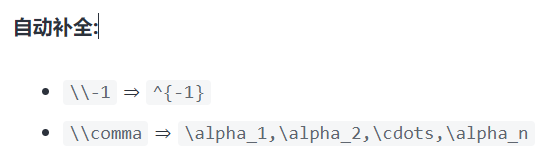
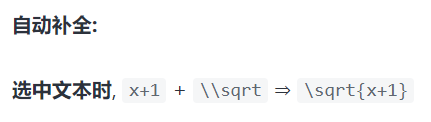
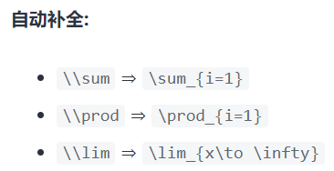
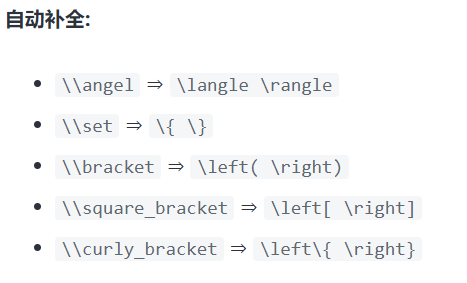
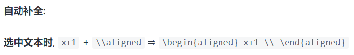
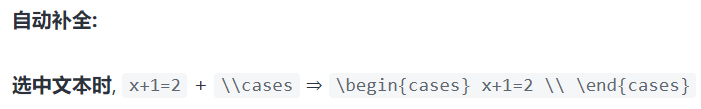
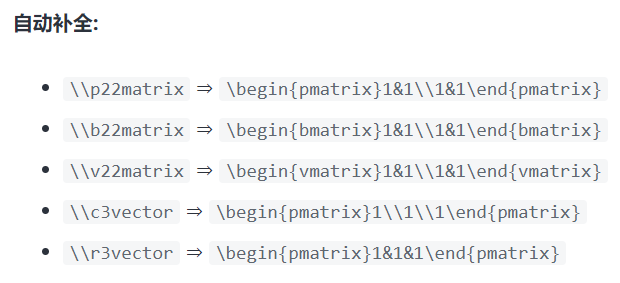

#数学公式支持

Markdown 的数学公式吸纳了大部分的 Latex 语法

行内公式: 

单位圆 $x^2+y^2=1$

公式块:

$$
\begin{cases}
x=\rho\cos\theta \\
y=\rho\sin\theta \\
\end{cases}
$$

==VSCode 有着非常便捷好用的自动补全功能==

---

### 1.上标与下标

上标 $ x^2 + y^{12} = 1 $

下标 $x_1 + y_{12} = 1$

$ x^{-1}  $

$ \alpha_1,\alpha_2,\cdots,\alpha_n $

---

### 2.分式

较小的行内行分数 $\frac{1}{2}$

展示型的分式 $\displaystyle\frac{x+1}{x-1}$

==其中 \displaystyle 用于将行内展示转为块状展示.==

$ \frac{x+1}{x-1} $

$ \displaystyle\frac{x + 1}{x - 1} $

---

### 3.根式

开平方 $\sqrt{2}$

开 $n$ 次方 $\sqrt[n]{2}$

---

### 4.空格

紧贴 $a\!b$

没有空格 $ab$

小空格 $a\,b$

中等空格 $a\;b$

大空格 $a\ b$

quad 空格 $a\quad b$

两个 quad 空格 $a\qquad b$

---

### 5. 累加, 累乘和积分

累加 $\sum_{k=1}^n\frac{1}{k}  \quad  \displaystyle\sum_{k=1}^n\frac{1}{k}$
<!--\\sum 即可, n 为上标 用^标出,  -->
$ \sum_{i=1}^ni^2+\sqrt[3]{i} $

---

累乘 $\prod_{k=1}^n\frac{1}{k}  \quad  \displaystyle\prod_{k=1}^n\frac{1}{k}$
<!-- \\prod -->
---

积分 $\displaystyle \int_0^1x{\rm d}x  \quad  \iint_{D_{xy}}  \quad  \iiint_{\Omega_{xyz}}$

$ \int $ 就是积分号

$ \lim_{x\to \infty}\frac{1}{x} $

---

### 6. 括号修饰

==用 \left 和 \right 可以让括号适配内部大小==

圆括号 $\displaystyle \left(\sum_{k=1}^{n}\frac{1}{k} \right)^2$

方括号 $\displaystyle \left[\sum_{k=1}^{n}\frac{1}{k} \right]^2$

花括号 $\displaystyle \left\{\sum_{k=1}^{n}\frac{1}{k} \right\}^2$

尖括号 $\displaystyle \left\langle\sum_{k=1}^{n}\frac{1}{k} \right\rangle^2$

$ \langle \rangle  \quad  \{\} \quad \left(  \right)  \quad $

$ \left[ \right] \quad  $

---

### 7. 多行算式对齐

居中:

$$
\begin{aligned}
y &=(x+5)^2-(x+1)^2 \\
&=(x^2+10x+25)-(x^2+2x+1) \\
&=8x+24 \\
\end{aligned}
$$

左对齐:

$
\begin{aligned}
y &=(x+5)^2-(x+1)^2 \\
&=(x^2+10x+25)-(x^2+2x+1) \\
&=8x+24 \\
\end{aligned}
$

$
\begin{aligned}
x+1 \\
\end{aligned}
$

---

### 8. 方程组

$$
\begin{cases}
k_{11}x_1+k_{12}x_2+\cdots+k_{1n}x_n=b_1 \\
k_{21}x_1+k_{22}x_2+\cdots+k_{2n}x_n=b_2 \\
\cdots \\
k_{n1}x_1+k_{n2}x_2+\cdots+k_{nn}x_n=b_n \\
\end{cases}
$$

$
\begin{cases}
11 \\
20 \\
222\\
2032\\
\end{cases}
$

---

### 9. 矩阵

矩阵:

$$
\begin{pmatrix}
1 & 1 & \cdots & 1 \\
1 & 1 & \cdots & 1 \\
\vdots & \vdots & \ddots & \vdots \\
1 & 1 & \cdots & 1 \\
\end{pmatrix}
$$

$$
\begin{bmatrix}
1 & 1 & \cdots & 1 \\
1 & 1 & \cdots & 1 \\
\vdots & \vdots & \ddots & \vdots \\
1 & 1 & \cdots & 1 \\
\end{bmatrix}
$$ 

行列式: 

$$
\begin{vmatrix}
1 & 1 & \cdots & 1 \\
1 & 1 & \cdots & 1 \\
\vdots & \vdots & \ddots & \vdots \\
1 & 1 & \cdots & 1 \\
\end{vmatrix}
$$

---

### 10. 特殊字符

更多特殊符号可以 上网查询

可以搜索 “**Latex 符号表**”

---

### 11. 公式编号与引用

$$
x+2 \tag{1.2}
$$

$$
\begin{equation}
x^n+y^n=z^n
\end{equation}
$$

由公式 $(1.2)$ 可得到结论

---

### 12. 零碎的重要语法

* 点乘 $\cdot$, 叉乘 $\times$, 异或 $\otimes$, 直和 $\oplus$, 加减 $\pm$, 复合 $\circ$.
* 
* 小于等于 $\leq$, 大于等于 $\geq$, 不等 $\neq$, 恒等 $\equiv$, 约等 $\approx$, 等价 $\cong$, 相似 $\sim$, 相似等于 $\simeq$, 点等 $\doteq$.
* 
* 逻辑与 $\land$, 逻辑或 $\lor$, 逻辑非 $\lnot$, 蕴涵 $\to$, 等价 $\leftrightarrow$.
* 
* 因为 $\because$, 所以 $\therefore$, 存在 $\exist$, 任意 $\forall$.
* 
* 左小箭头 $\leftarrow$, 右小箭头 $\rightarrow$, 左大箭头 $\Leftarrow$, 右大箭头 $\Rightarrow$, 右长箭头 $\xrightarrow[fgh]{abcde}$.
* 
* 属于 $\in$, 包含于 $\subset$, 真包含于 $\subseteq$, 交 $\cap$, 并 $\cup$, 空集 $\empty$
* 
* 短向量 $\vec{x}$, 长向量 $\overrightarrow{AB}$, 上横线 $\overline{p}$.
无限 $\infty$, 极限 $\lim$, 微分 ${\rm d}$, 偏导 $\partial$, 点求导 $\dot{y}$, 点二阶导 $\ddot{y}$, 变化量 $\Delta$, 梯度 $\nabla$.

* 横省略 $\cdots$, 竖省略 $\vdots$, 斜省略 $\ddots$.
* 
* 常见函数 $\sin$, $\cos$, $\tan$, $\arcsin$, $\arccos$, $\arctan$, $\ln$, $\log$, $\exp$.

$ (1+2)/222 $

$ \frac{1+2}{3+4} $

