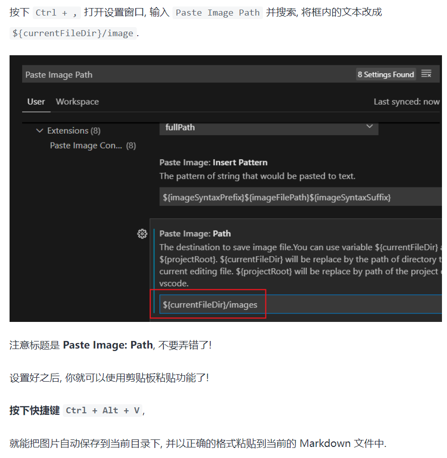

<!-- 标题的方法建议使用第一种, 即在前面加上 # -->
# 一级标题

## 二级标题

### 三级标题

段落.

---

一级标题
=======

二级标题
-------

---


段落和段落之间要隔一行.

就像这样.


三条横线 (或更多的横线) 表示分割线.

---

就像这样.

----------


**重点加粗 ctrl + B**

*斜体 ctrl + I*

~~删除线~~

==高亮==

---


* 无序列表
  * 嵌套无序列表
  * 嵌套无序列表
* 无序列表
* 无序列表

1. 有序列表 1
   1. 嵌套有序列表 1
   2. 嵌套有序列表 2
2. 有序列表 2
3. 有序列表 3

---

任务列表:

- [x] 已经完成的事 1
- [x] 已经完成的事 2
- [x] 已经完成的事 3
- [ ] 仍未完成的事 4
- [ ] 仍未完成的事 5

---

缩进快捷键 : ctrl + [    ctrl + ]

---

引用文本:

> 引用别人说的话
> 就这样写
> By. OrangeX4

---

#行内代码

这是 `行内代码` 语法.

代码块语法:

``` python
print("Hello, World!")
```

注意要将 ' 替换成 `.

` 在 Esc 下方

---

##代码行数的显示:

``` javascript {.line-numbers}
function add(x, y) {
  return x + y
}
```

注意要将 ' 替换成 `.

{.line-numbers}表示显式代码行数

---

``` java {.line-numbers}
public class App {
    public static void main(String[] args) throws Exception {
        System.out.println("Hello, World!");
        //好好好
    }
}
```

---

#超链接与图片

[超链接名称](链接地址)


例如, 可以使用网址和图床:

[隔岸DJ-乐然拉](https://www.bilibili.com/video/BV1M64y1a7zh?from=search&seid=17876414671726321943&spm_id_from=333.337.0.0)


==动图好像不行==

也可以在本地用相对地址:

[Markdown](Markdown.md)


---

##==剪切板图片导入==

1.使用 ctrl + alt + v 
保存到本地并上传到Markdown



2.使用 shift + ctrl + alt + v
上传到图床并导入到Markdown


---

#表格

| 表头 | 表头 |
| ---- | ---- |
| 内容 | 内容 |
| 内容 | 内容 |

拓展语法:

| 表头 | 表头 |
| ---- | ---- |
| 内容 | 内容 |
| >    | 内容 |

| 表头 | 表头 |
| ---- | ---- |
| 内容 | 内容 |
| ^    | 内容 |

---

#注释

注释:ctrl + /

<!-- 你看不见我 -->

<!-- 多行注释
就像这样 -->

---

##关于渲染

有一点很重要的就是, VSCode 会在你**每次修改代码**之后, **重新渲染一遍**.

如果有**很多很多的数学公式**, 渲染会**很慢**, 这时候有两个建议:

* **分成多个文件, 避免单文件过大!**
* **将你暂时不看的部分注释掉, 加快渲染速度!**

---


