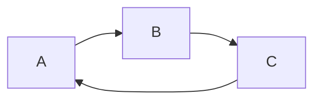

[TOC]


## [参考教程](https://orangex4.cool/post/notes-in-markdown/#markdown-%E8%BF%9B%E9%98%B6-%E9%80%89%E7%9C%8B)

---

# Markdown 进阶

---

### 自动目录

<!--[TOC]-->

### 画图

#### 流程图


```
'''mermaid
graph LR
    A --> B
    B --> C
    C --> A
'''
```

#### 时序图

```wavedrom
{ signal:[
    {   name:'clk', wave:'p..Pp...P'}
]}
```

#### 饼图

